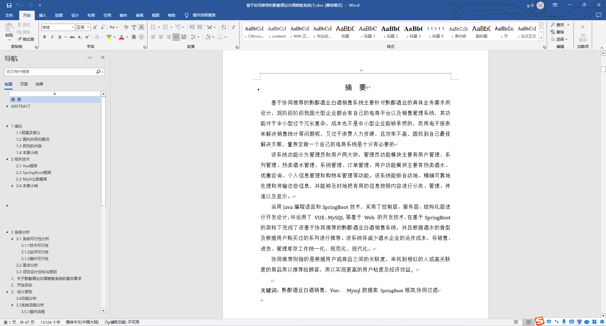
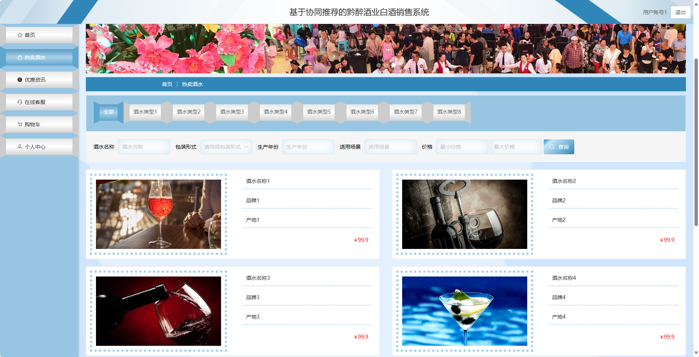
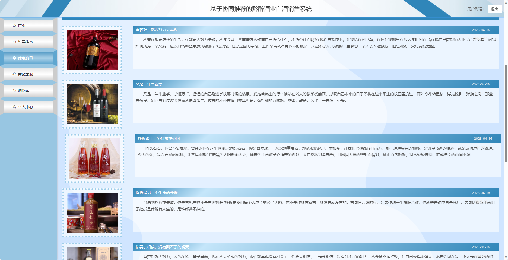
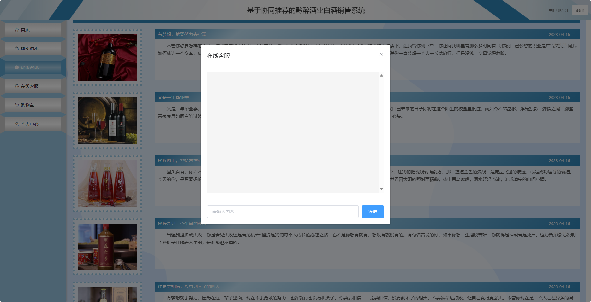
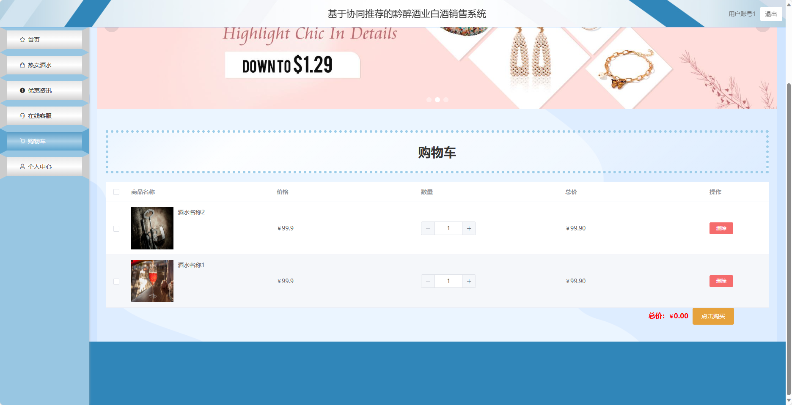
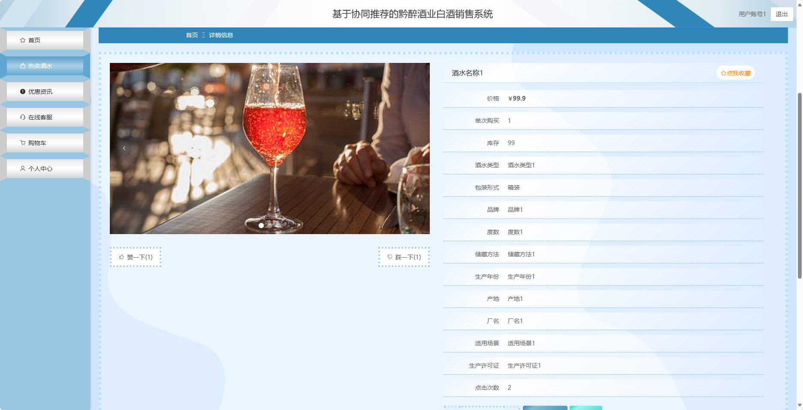
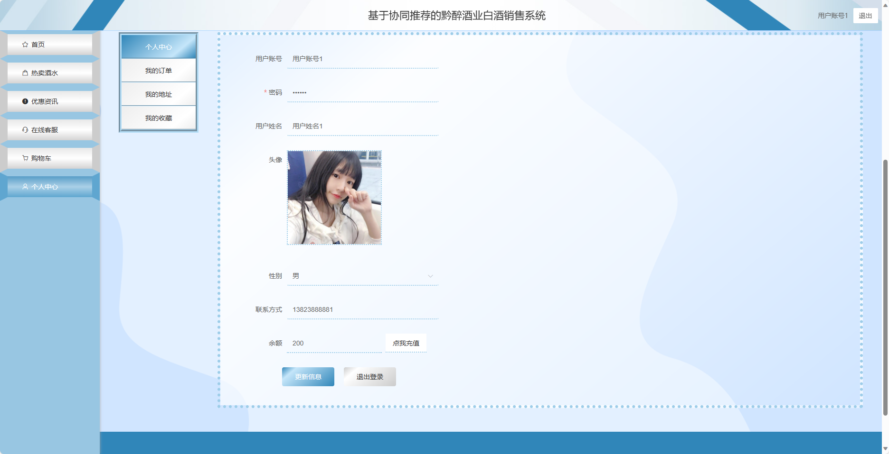
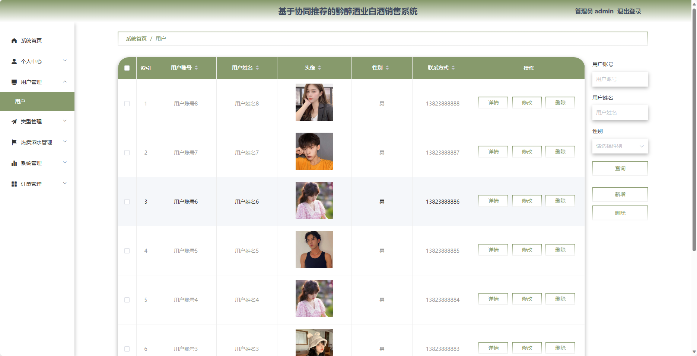
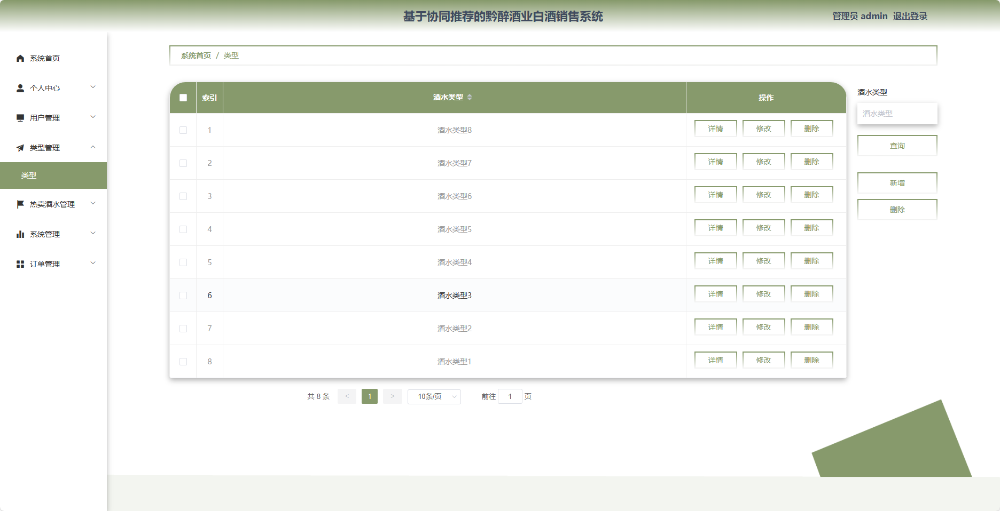
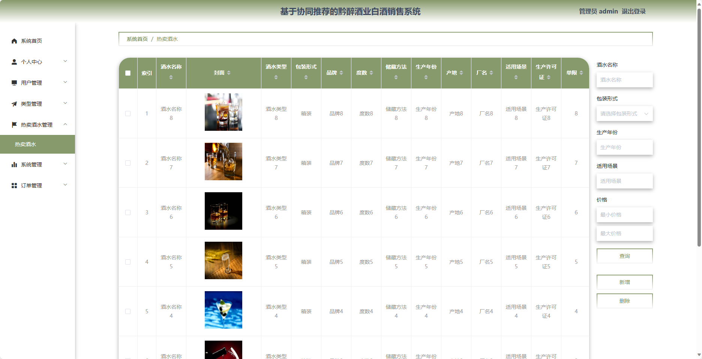

## 基于协同过滤算法的黔醉酒业白酒销售系统(程序+报告)

###  获取sql数据库文件: 从戎源码网 (https://armycodes.com/) QQ: 386869957 QQ群: 377586148
###  所有系统地址: (https://github.com/YuLin-Coder/AllProjectCatalog) 
###  所有项目以及源代码本人均调试运行无问题 可支持远程安装部署调试、定制修改、代码讲解

## 项目介绍
基于协同过滤算法的黔醉酒业白酒销售系统，系统包含两种角色：管理员、用户,系统分为前台和后台两大模块，主要功能如下。

### 【管理员】:
1. 个人中心：管理员可以管理个人信息，包括修改密码等操作。
2. 用户管理：管理员可以管理用户信息，包括查看用户列表、禁用用户等操作。
3. 型管理：管理员可以管理酒水的类型信息，包括添加、编辑、删除等操作。
4. 热卖酒水管理：管理员可以管理热卖酒水的信息，包括添加、编辑、删除等操作。
5. 系统管理：管理员可以管理系统的参数设置、日志查看等功能。
6. 订单管理：管理员可以查看用户的订单信息，包括审核、取消等操作。

### 【前台】:
1. 热卖酒水：展示当前热门的酒水产品。
2. 优惠资讯：提供最新的优惠活动和促销信息。
3. 在线客服：用户可以通过在线客服与客服人员进行实时沟通和咨询。
4. 购物车：用户可以将感兴趣的酒水产品加入购物车。
5. 个人中心：用户可以管理个人信息，包括修改密码、查看订单历史等操作。

## 项目技术
- 编程语言：Java
- 数据库：MySQL
- 项目管理工具：Maven
- 前端技术：HTML、CSS、JavaScript、Jquery、Vue
- 后端技术：Spring、SpringMVC、MyBatis

## 运行环境
- JDK版本：JDK1.8及以上
- 开发工具：IDEA、Ecplise、Myecplise都可以
- 数据库: MySQL5.7及以上
- Maven：maven3.0及以上
- Node：14.14.0及以上

## 运行截图

